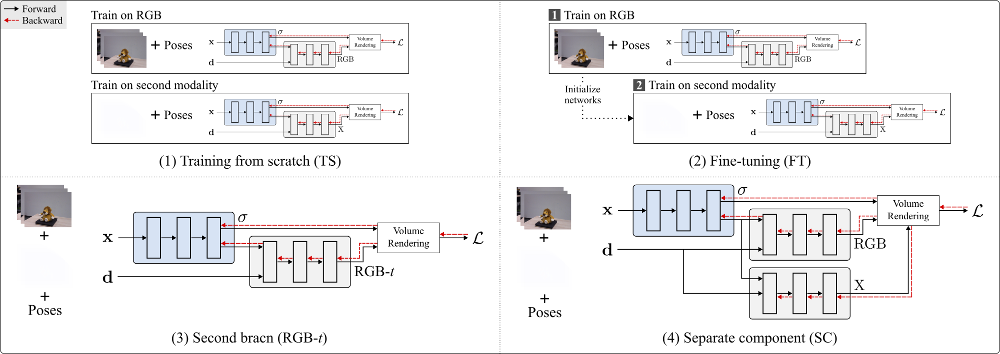

# Exploring Multi-modal Neural Scene Representations With Applications on Thermal Imaging




Abstract: *Neural Radiance Fields (NeRFs) quickly evolved as the new de-facto standard for the task of novel view synthesis when trained on a set of RGB images. In this paper, we conduct a comprehensive evaluation of neural scene representations, such as NeRFs, in the context of multi-modal learning. Specifically, we present four different strategies of how to incorporate a second modality, other than RGB, into NeRFs: (1) training from scratch independently on both modalities; (2) pre-training on RGB and fine-tuning on the second modality; (3) adding a second branch; and (4) adding a separate component to predict (color) values of the additional modality. We chose thermal imaging as second modality since it strongly differs from RGB in terms of radiosity, making it challenging to integrate into neural scene representations. For the evaluation of the proposed strategies, we captured a new publicly available multi-view dataset, ThermalMix, consisting of six common objects and about 360 RGB and thermal images in total. We employ cross-modality calibration prior to data capturing, leading to high-quality alignments between RGB and thermal images. Our findings reveal that adding a second branch to NeRF performs best for novel view synthesis on thermal images while also yielding compelling results on RGB. Finally, we also show that our analysis generalizes to other modalities, including near-infrared images and depth maps.*


## Installation

Clone the repo and:

```bash
pip install -r requirements.txt

bash scripts/install_ext.sh
```

## Usage

Simply use the model arguments to train on the selected strategy with mapped thermal values. For example, for Lion:

Training from Scratch (TS):
```bash
python main.py ./dataset/lion --workspace lion_ts --ts --val_idx 20  --tv 48.3 --tv_min 16.8
```

RGB-*t*:
```bash
python main.py ./dataset/lion --workspace lion_rgbt --rgbt --val_idx 20  --tv 48.3 --tv_min 16.8
```

Separate Component (SC):
```bash
python main.py ./dataset/lion --workspace lion_sc --sc --val_idx 20  --tv 48.3 --tv_min 16.8
```


## References
- Mildenhall et al., NeRF: Representing scenes as neural radiance fields for view synthesis. ECCV, 2020.
- Müller et al., Instant neural graphics primitives with a multiresolution hash encoding. ACM Transactions on Graphics (TOG), 2022.
- torch-ngp